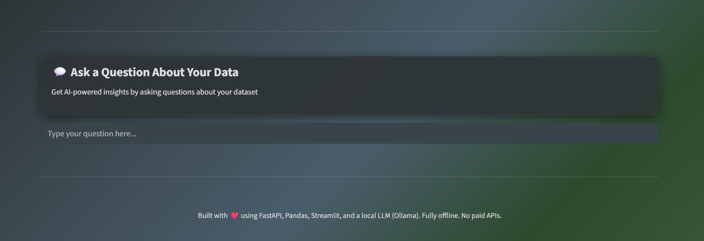
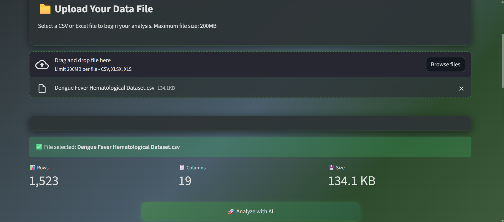
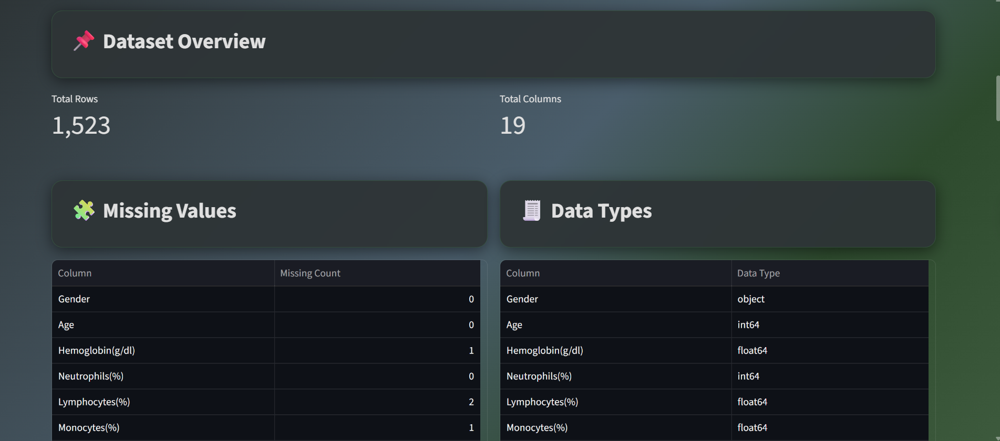
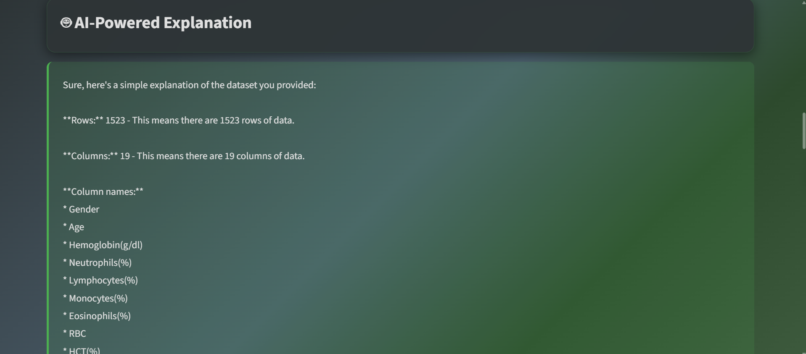
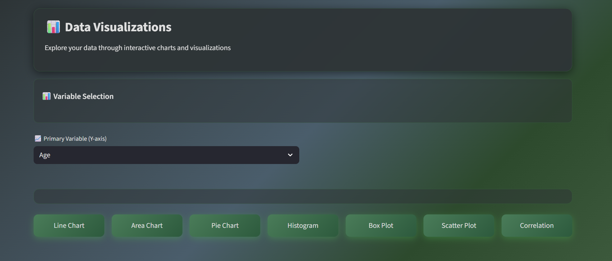
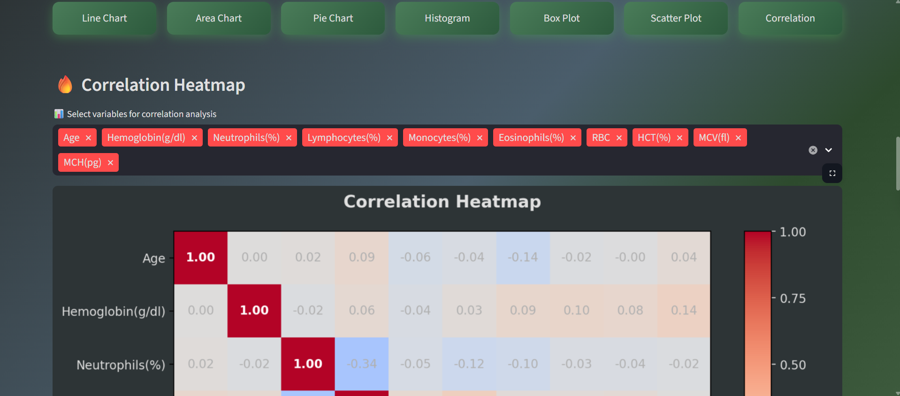
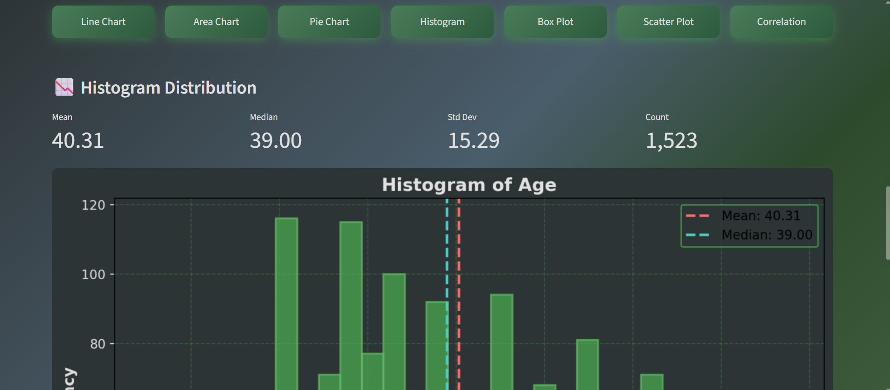

# LLM Powered Data Analyst

An AI-powered backend application that allows users to upload datasets (CSV/Excel),
automatically analyzes the data, and generates human-readable insights using a local LLM.

## Features
- Upload CSV or Excel files
- Automatic EDA (missing values, data types, statistics)
- LLM-generated explanations using Ollama
- FastAPI backend
- Fully free & runs locally

## Website View













## Tech Stack
- Python
- FastAPI
- Pandas
- Ollama (Gemma 2B)
- Uvicorn

## How to Run
```bash
python -m venv .venv
.venv\Scripts\activate
pip install -r requirements.txt
uvicorn backend.main:app --reload
